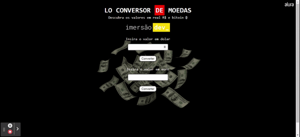

<h1 align="center" font-size="bold" color-font="red"> Lo conversor de moeda </h1>

  

# Resumo do projeto

  
  ``Projeto criado na imersão_dev da Alura!``
  
  ``Com esse conversor é possivel converter valores em dolar ou euro em reais e bitcoin.``

## 🔨 Funcionalidades do projeto

- `Funcionalidade 1` `Calculo`: Calculo automatico de acordo com a moeda escolhida.
- `Funcionalidade 2` `Dolar`: Conversão de dolar para real.
- `Funcionalidade 3` `Euro`: Conversão de euro para real.
- `Funcionalidade 4` `Bitcoin`: Conversão também para bitcoin.

## ✔️ Tecnologias utilizadas

- ``JavaScript``
- ``HTML5``
- ``CSS3``
- ``VS code``

## 💻 Acesse o site

https://lo-conversor.vercel.app/
